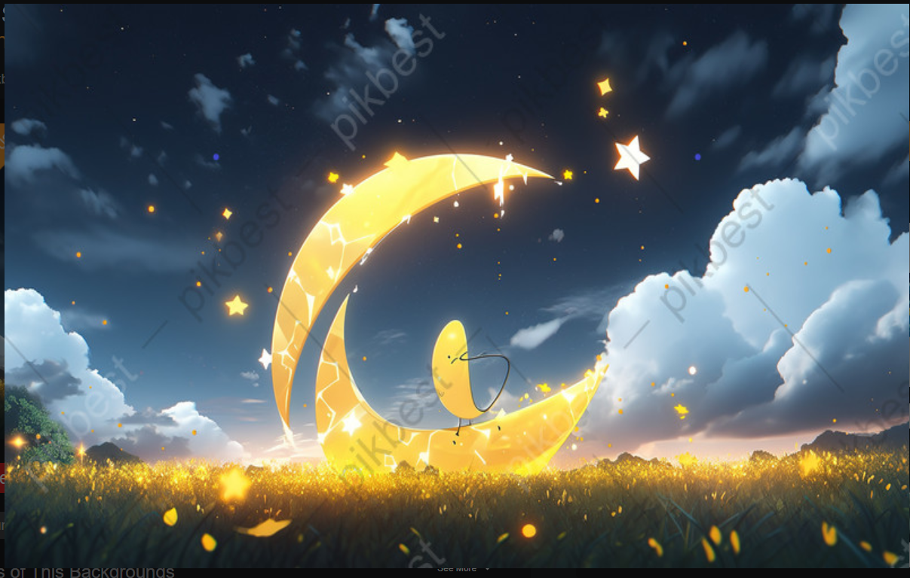

# Starlit-Tales-The-AI-Dream-Story-Generator

# 🌙✨ Starlit Tales: The AI Dream Story Generator

> Let your imagination soar across starfields and fairy tales...  
> Just give a magical prompt, and watch stories unfold with moonlight and machine learning.

---

## 🪄 What is This?

**Starlit Tales** is a whimsical AI-powered story generator built using **Hugging Face Transformers** and **Gradio** with a dreamy cartoon-themed UI.  
It allows you to enter a creative prompt, adjust the creativity level, and get a complete 150–200 word story with a satisfying ending.

---

## ✨ Features

- 🌌 **Dreamy Background Theme** with custom UI
- 💭 **Prompt-based story generation**
- 🎨 Adjustable **creativity slider**
- 🧠 Powered by **GPT-2** via Hugging Face 🤗
- 📖 Generates well-formed, complete stories (~200 words)

---

